

## Summary
SeeFood is an iOS app built using Swift. It allows users to find photos of food posted by other users in an organized/categorized manner. Therefore, users can view the photo of the food they're interested in ordering. Stack used are Google Places API, Facebook API, Clarifai API, Cocoapods and Parse database on Heroku for backend.

___

## Data Stored using Parse on Heroku
All data contains creation date
- Restaurant
  - ID (Identifier to match with Google Places API)
  - Name
  - One-to-Many Menu Items
- MenuItems
  - Title
  - One-to-Many Reviews
  - One-to-One Restaurant
- Reviews
  - User (who created the review) 
  - Image Data File
  - One-to-Many Tags
  - One-to-One MenuItem
- Tags
  - One-to-One Review
  - CenterX Location (percentage image size to allow scalability from iPhone to iPads)
  - CenterY Location (percentage image size to allow scalability from iPhone to iPads)

___

# Preview

### Login & Sign Up
User data is stored using Parse or user can login using Facebook API.

### Finding a Restaurant
- Restaurants are found using Google Places API and a record stored using Parse.
- Search Bar can be used to search for specific restaurants.

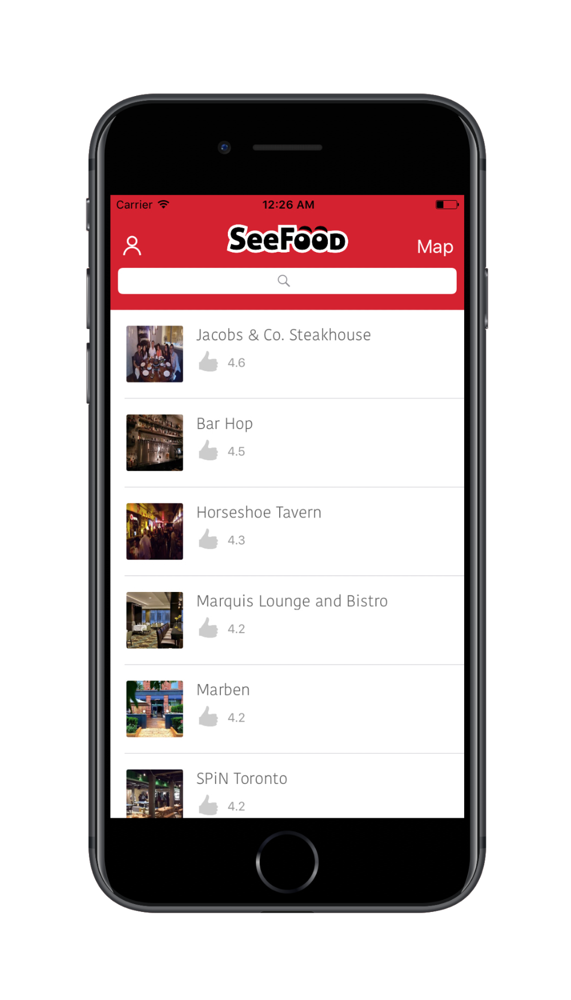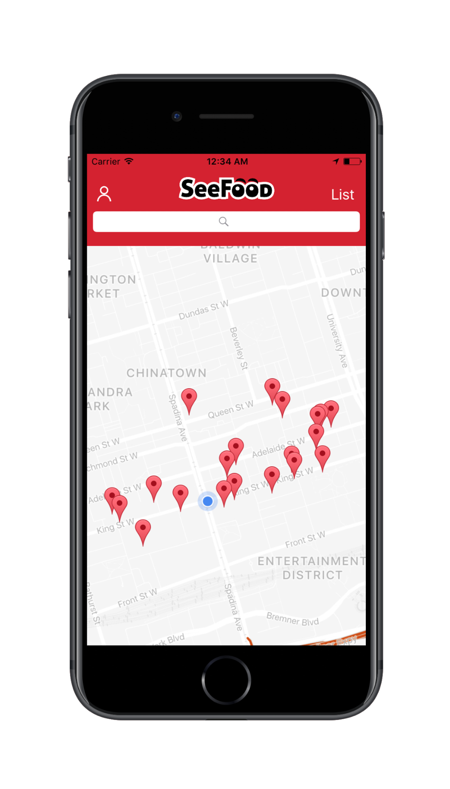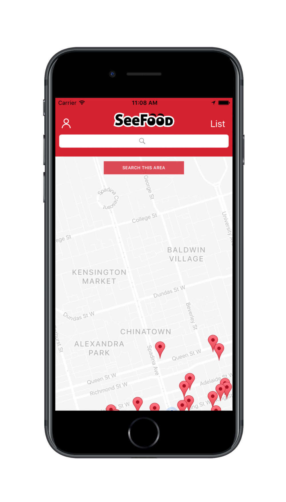

### Finding a Menu Item
- Menu Items, Photos and Tags are stored using Parse.
- Force touch is available to preview an item in the gallery view.

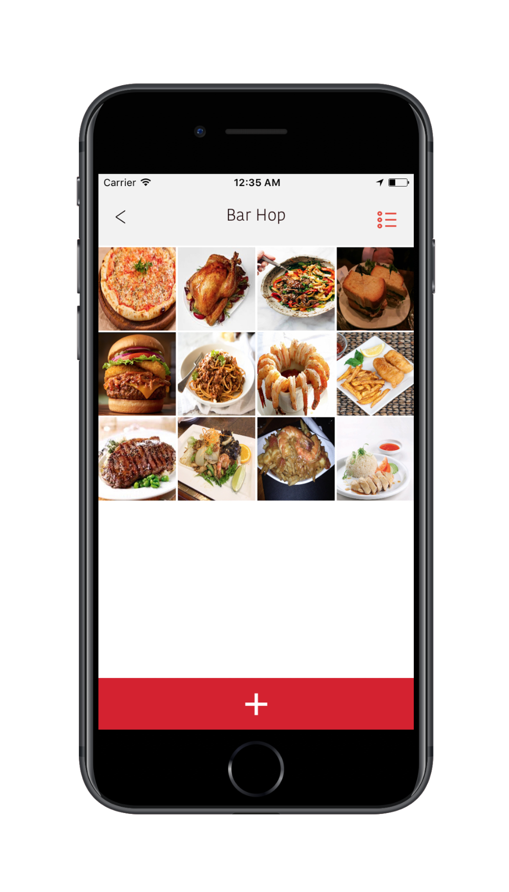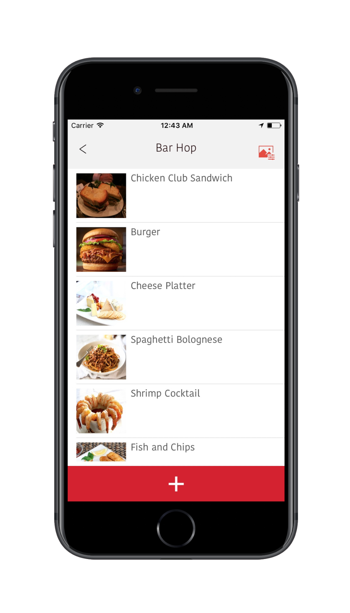

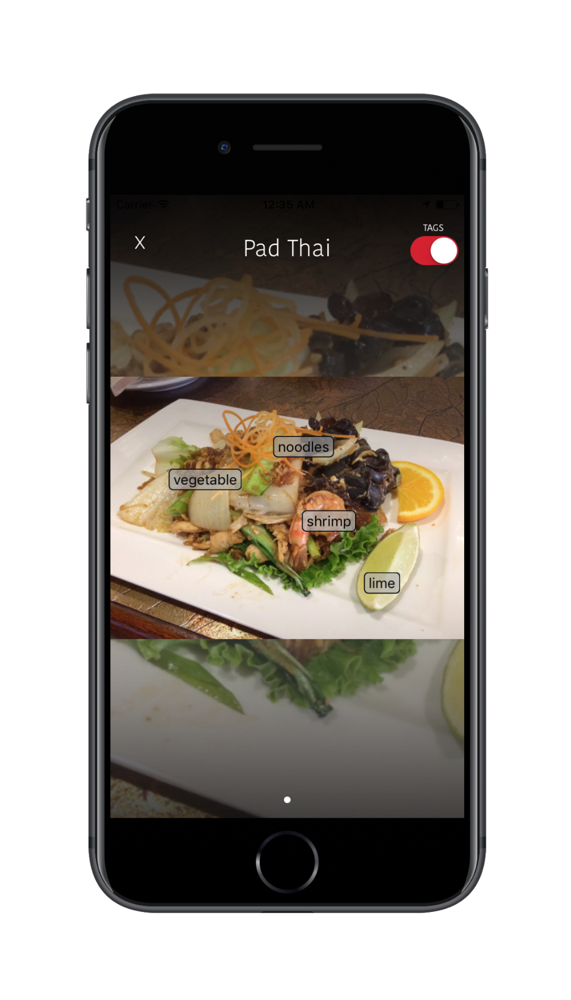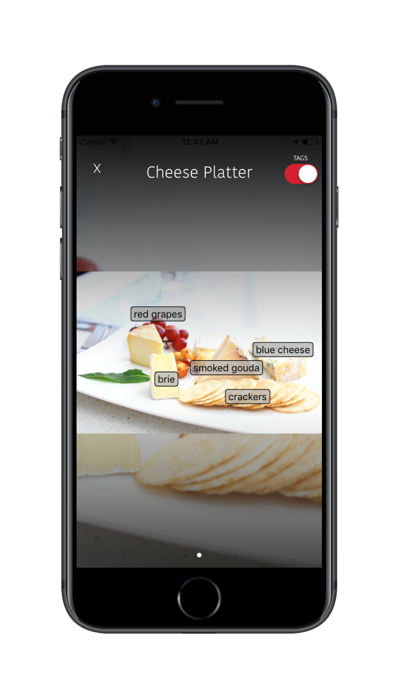

### Posting a Photo
- Users can upload a photo using Camera or Photo Library. 
- Login is required to post a photo.
- Initial Tags are generated using photo recognition from Clarifai API.
- Users can add custom tags or drag and drop tags to the photo.
- Autocomplete is added to prevent duplicate Menu Items.

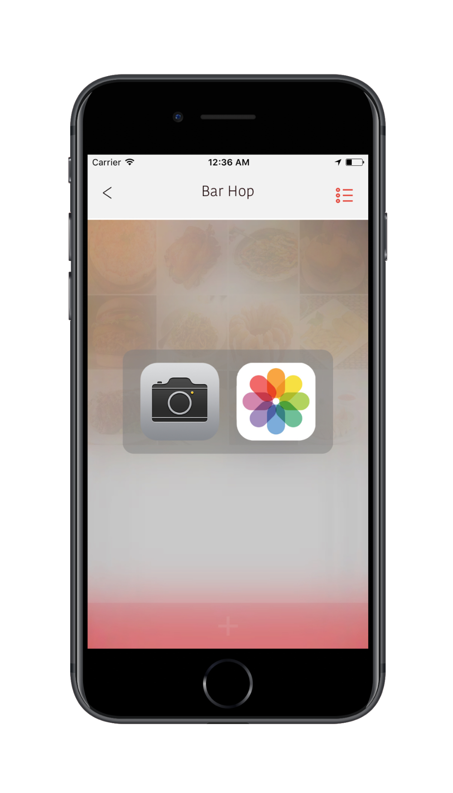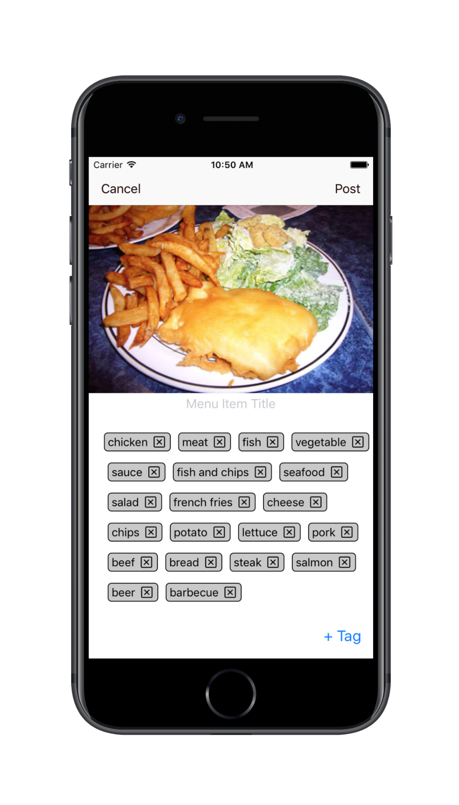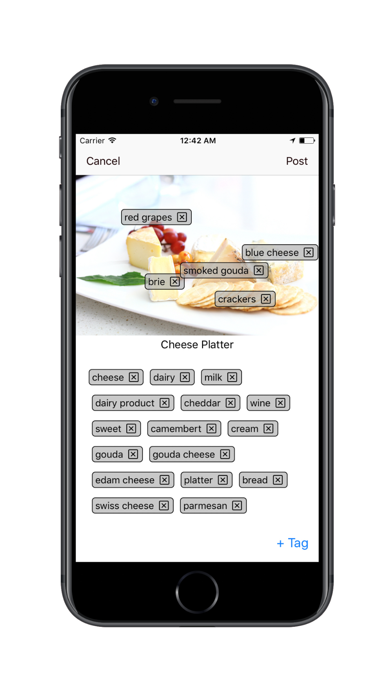
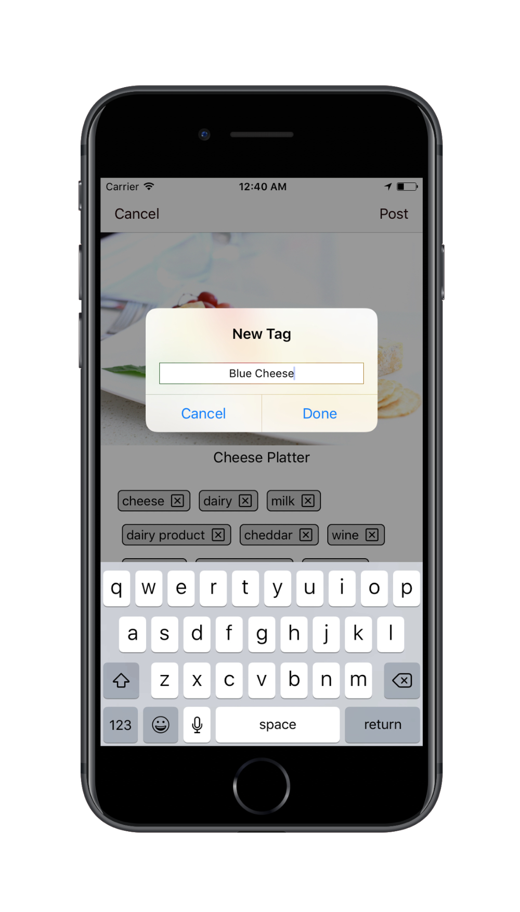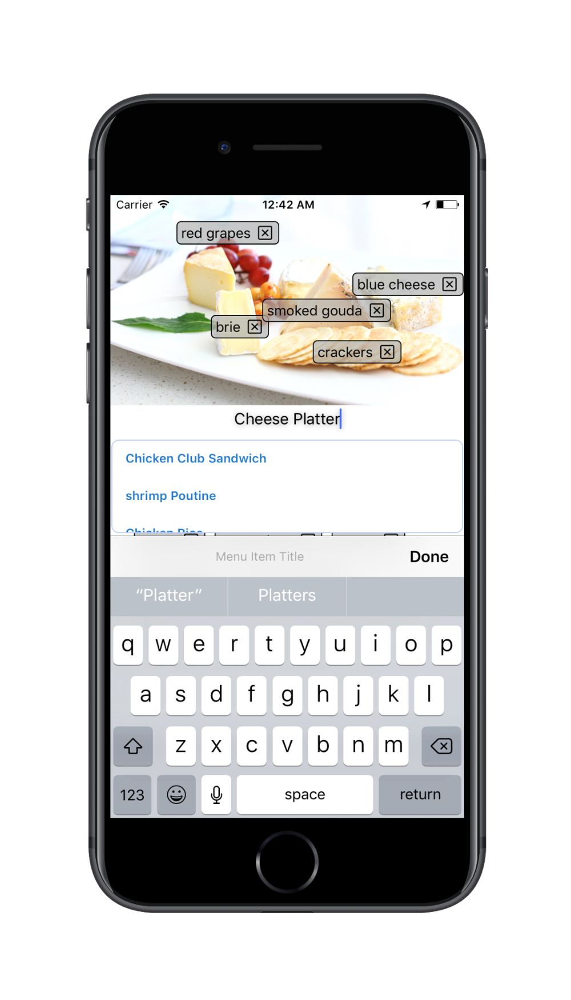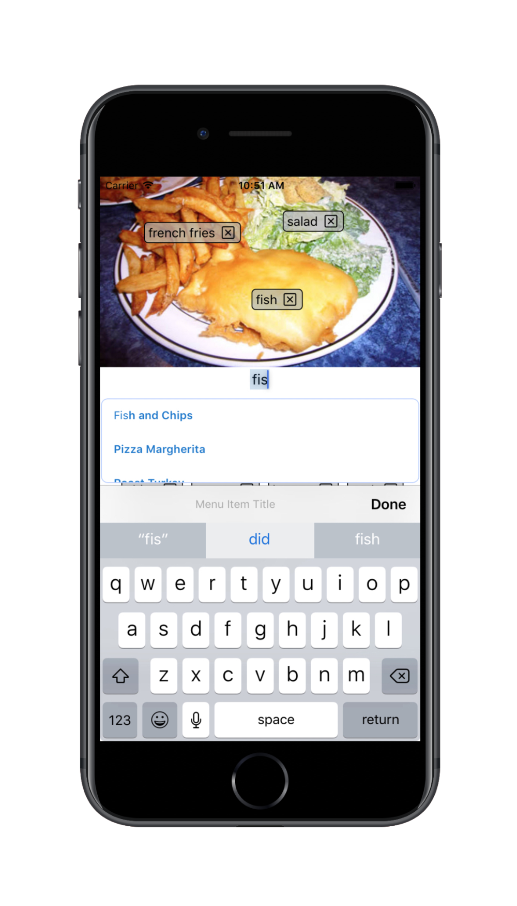

### Potential Problems & Improvements
1. Get users to provide food ratings
    - Problem: Difficult as users post photos before trying to food
    - Solution: Notification to rate the food 1-2 hours after the posting
2. Integrate social media sharing (Use photo tags for hashtags)
3. Search for food based on Tags or Menu Title
